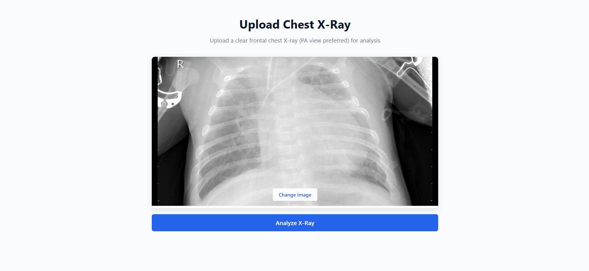

# 🫁 Pneumonia Detection Web App (FastAPI + React)


A lightweight web app that detects **Pneumonia** from chest X-ray images using a **Keras CNN model** served with **FastAPI**, and a **React** frontend for user interaction.  

> ⚠️ **Important:** This project is tested with **Python 3.10**. Using other Python versions may cause compatibility issues with TensorFlow/Keras.

---

## 🏞 Demo

<p align="center">
  
</p>

---

## 🖼 Screenshots

### 🔹 Homepage
<p align="center">
  
</p>

### 🔹 Upload X-ray
<p align="center">
  
</p>

### 🔹 Prediction Result
<p align="center">
  
</p>

---

## 📂 Project Structure

```

Pneumonia-Detection/
│
├── backend/
│   ├── main.py                  # FastAPI backend and inference logic
│   ├── requirements.txt         # Backend dependencies
│   └── ai_env/                  # Local virtual environment (not committed)
│
├── model/
│   └── pneumonia_model.keras    # Trained Keras CNN model
│
├── dataset/
│   └── chest_xray/              # Dataset (train/test/val) if available
│
├── frontend/
│   ├── public/
│   │   └── index.html
│   ├── src/
│   │   ├── App.js
│   │   ├── App.css
│   │   └── index.js
│   └── package.json
│
├── assets/
│   ├── demo.gif
│   ├── herosection.png
│   ├── upload.png
│   └── result.png
│
├── training/
│   └── pneumonia_detection.ipynb   # Model training notebook
│
└── README.md

````

---

## ⚙️ Installation & Setup

### 1️⃣ Backend (FastAPI)

```bash
cd backend
py -3.10 -m venv venv

# Windows
venv\Scripts\activate
# Linux/Mac
# source venv/bin/activate

pip install -r requirements.txt
uvicorn main:app --reload 
````

* Backend will start at: `http://127.0.0.1:8000`
* **Prediction endpoint:** `POST /predict` (multipart/form-data with `file` field)

### 2️⃣ Frontend (React)

```bash
cd frontend
npm install
npm start
```

* Frontend will start at: `http://localhost:3000`
* Connects to backend automatically via CORS configuration.

---

## 🧠 Model Details

* Trained with **TensorFlow 2.19.0** and **Keras 3.10.0**
* Input: Grayscale X-ray images resized to **224×224**
* Output: Prediction `"Pneumonia"` or `"Normal"` with confidence score
* Model loaded from: `model/pneumonia_model.keras`

---

## 🧩 Backend API

### GET `/`

* Health check

```json
{"message": "Pneumonia Detection API Running"}
```

### POST `/predict`

* Accepts multipart form-data: `file`
* Returns JSON:

```json
{
  "predicted_class": "Pneumonia",
  "confidence": 92.34
}
```

---

## 🔮 Future Improvements

* Deploy full-stack app on **Render / Heroku / Netlify**
* Add more medical imaging datasets
* Improve model accuracy using transfer learning or deeper CNN architectures
* Implement user authentication for secure uploads

---

## 📜 License

MIT License. See [LICENSE](LICENSE) for details.


